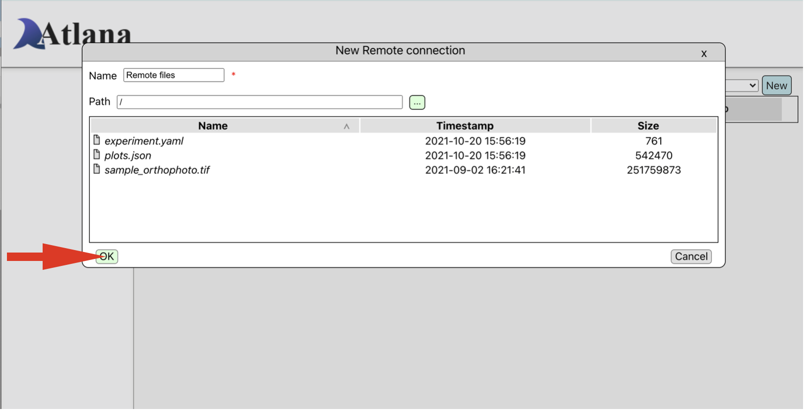
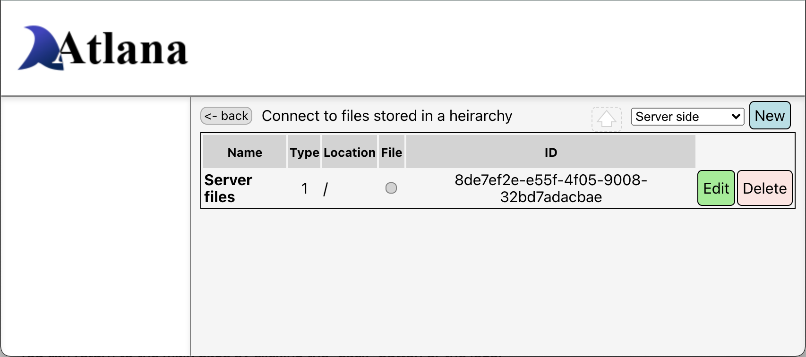
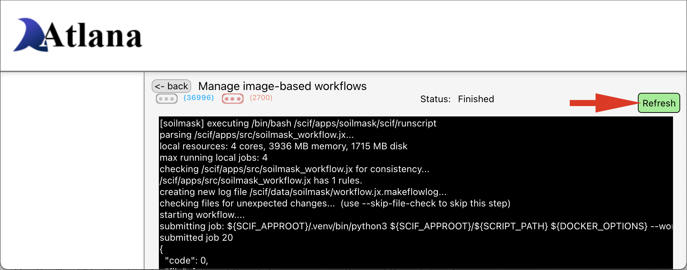

# Welcome to Atlana

Atlana is our web interface used to configure and run workflows for processing drone captured data.

## What's available
The UI provides a convienient way for running workflows.
It also provide ways to:

 * configure one or more storage locations at the folder and file levels
 * download and restore configured storage locations
 * run workflows
 * create new workflows that use git repositories
 * re-run jobs you've created and jobs others have created
 * download and restore workflows you've created and workflows you've run

The downloaded configurations of storage locations and workflows are in JSON format and can be shared with others.

## Tutorial
Items needed:

- an orthomosaic image to be processed
- a GeoJSON file containing the plots of interest
- an optional YAML file containing [experiment information](https://osf.io/xdkcy/wiki/Configuration%20YAML/) [](https://osf.io/xdkcy/wiki/Configuration%20YAML/)

What we will  be doing:

1. [Upload files and configure](#uploading-and-configuring-files) a file endpoint on the remote system
2. Running the [Canopy Cover image-based workflow](#running-a-workflow)
3. [Downloading the results](#downloading-the-results) to the local computer
4. [Deleting](#delete-workflow-run) the workflow run

Note that the geographic boundaries of the image don't need to match that of the plots.
Only those plots that intersect the image will be processed.

Additionally, the coordinate system of the image doesn't need to match that of the plots.
Plot points are converted automatically to the image's geographic coordinate system.

### Sample data

We also provide an [archive of sample data](https://data.cyverse.org/dav-anon/iplant/projects/aes/cct/diag/sample-data/sample_website_data.tar.gz
) [](https://data.cyverse.org/dav-anon/iplant/projects/aes/cct/diag/sample-data/sample_website_data.tar.gz) that can be downloaded and used in this Tutorial.
Be sure to extract the files from this archive before uploading them.
Uploaded archives are **not** usable by the system.

The following `bash` commands can be used to download the archive and extract the files.

```bash
curl --output sample_website_data.tar.gz https://data.cyverse.org/dav-anon/iplant/projects/aes/cct/diag/sample-data/sample_website_data.tar.gz
tar -xzf sample_website_data.tar.gz
```

### Uploading and configuring files

On the main page of the site, click the `files` link under **Data Sources**.
This will take you to the file storage definition page


Next click the upload icon, select and upload the files to process.
You may see an  message on the icon if it takes a few seconds to upload the files.
You can also drag-and-drop files onto the upload location.


Next, select "Server Side" from the drop down on the upper right of the page, and click "New".


This will display a new window showing the uploaded files.
You may change the name of the endpoing to something more meaningful.
Select "OK" to complete defining the endpoint and dismiss the window.



The configured access is now available to workflows and shown on the page.



You can return to the main page by clicking the "back" button.


### Running a workflow

On the main page of the site, click the `Image` link under **Workflows**.


Choose "Canopy Cover" from the drop down on the upper right of the page, and click "Run".


The fields needed for running this workflow are shown on the page.
We will be configuring the "Image file" field next.


Select the ellipses next to "Image file" to bring up the browsing window.
Since we've  only defined one file configuration, it will be automatically chosen for us.
Select the orthomosaic file and click "OK" to confirm your selection and dismiss the window.
If you are using the sample data, the name of the file to choose is "sample_orthophoto.tif".


Click the ellipses next to each of the other entries to choose the GeoJSON and YAML experiment files for this workflow.

Once the fields are fill in, click the "Run" button under the entries to start the workflow.


You will be returned to the Workflow listing page showing your running job.
The status of the job is automatically updated.
Other jobs may also be displayed in the listing.
Next we are going to navigate to view the output of the running workflow.


To see how the workflow job is proceeding, click the "View" button next to the workflow we just created.
This will display a page where the status of the job is display and you can access normal and warning/error messages.
To update the messages and warnings/errors, click the "Refresh" button.
If there are many messages retrieved from the server, it may take a few seconds before the messages are displayed.

The current count of regular and warning/error messages are updated after refreshing.
Clicking on the counts will switch between the message types.



Use the "back" button to return to the workflow listing page.
Click the "View" button again on the workflow listing page to re-display the messages.


### Downloading the results

On the workflow listing page, completed workflows have a download button to the far right of their name.
Clicking the download button will download the CSV file ccontaining the results and the JSON of the job definition.


If you have downloaded our [sample data](#sample-data) for processing and used that for running the Canopy Cover workflow, you can compare the extracted CSV file against your results.

### Delete workflow run

Click "Delete" to the right of the workflow run name that you want to delete.
This will remove all files and information associated with the workflow run.
If you are happy with the results, be sure to [download the results](#downloading-the-results) before deleting the workflow run.


